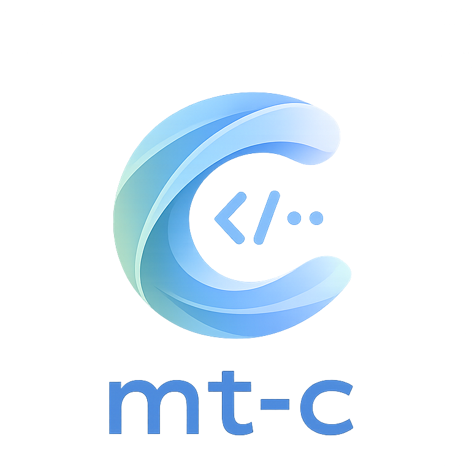

<p align="center">
  
</p>

<p align="center">
  <strong>Точная маршрутизация. Меньше памяти. Больше пропускной способности.</strong>
  <br/>
  <sub>C11-движок для MagiTrickle · Entware / Keenetic · OpenWrt</sub>
</p>

<p align="center">
  <a href="#почему-mt-c">Почему mt-c</a> ·
  <a href="#установка">Установка</a> ·
  <a href="#описание-типов-правил">Типы правил</a> ·
  <a href="docs/swagger.yaml">HTTP API</a>
</p>

**mt-c** — [MagiTrickle](https://magitrickle.dev), полностью переписанный с Go на **C11**. Тот же конфиг, HTTP API и поведение — но заметно меньше накладных расходов на слабом железе роутера.

## Назначение

mt-c (произносится как *Мэджитрикл*, по названию проекта, от которого он унаследован) – утилита для точечной маршрутизации сетевого трафика по заданным доменным именам. Представляет собой установочный пакет, устанавливаемый в дополнение к операционной системе маршрутизатора.

<p align="center">
  
</p>

Принцип работы основан на подмене основного DNS-сервера через промежуточный компонент без его отключения. Это позволяет перехватывать входящие DNS-запросы, кешировать ответы и сопоставлять IP-адреса с доменными именами. Благодаря этому становится возможной маршрутизация трафика без необходимости очистки DNS-кэша на стороне клиентов. Очистка кэша требуется только при запуске или перезапуске сервиса, поскольку в этот момент кэш ещё не прогрет, и маршрутизация невозможна до первого запроса к нужному домену.

## Установка

Пакеты для Entware/Keenetic и обеих актуальных веток OpenWrt собираются в GitHub Actions и публикуются на странице [Releases](https://github.com/dan0102dan/mt-c/releases). Скачайте пакет под версию OpenWrt и архитектуру роутера:

**Entware/Keenetic:**
```shell
opkg install ./magitrickle_<версия>_entware_<архитектура>.ipk
/opt/etc/init.d/S99magitrickle start
```

**OpenWrt (≤ 24.10, opkg):**
```shell
opkg install ./magitrickle_<версия>_openwrt-24.10.4_<архитектура>.ipk
service magitrickle start
```

**OpenWrt 25.12+ (apk):**
```shell
apk add --allow-untrusted ./magitrickle_<версия>_openwrt-25.12.5_<архитектура>.apk
service magitrickle start
```

Обновление — тем же способом (скачать новую версию, установить, `restart` вместо `start`). Пакеты `.ipk` и `.apk` собираются разными SDK (24.10 и 25.12 соответственно), поэтому формат нужно выбирать по версии установленной OpenWrt.

## Почему mt-c

Оригинальный MagiTrickle написан на Go. mt-c — полный переписанный движок на C11: тот же формат конфига, тот же HTTP API, то же поведение iptables/ipset (`MT_`/`mt_`-префиксы цепочек и множеств не изменились) — апгрейд прозрачен, конфиг и состояние переживают переход в обе стороны. Каждое сознательное расхождение с оригиналом задокументировано (см. `docs/c-rewrite/decisions.md`), молчаливых отличий в поведении нет.

Что это даёт на практике:

- **Нет сборщика мусора и рантайма Go.** Один поток с событийным циклом на `epoll` вместо 10 Go-потоков — меньше накладных расходов планировщика и никаких пауз на GC под нагрузкой.
- **Кардинально меньший footprint** — критично для роутеров с 32–128 МБ RAM и небольшой флеш-памятью:

  | Метрика | Go | mt-c | Разница |
  |---|---|---|---|
  | Размер бинарника | 9.6 МБ | **~260 КБ** | ~36× меньше |
  | RSS в простое | 15.3 МБ | **3.3 МБ** | ~4.6× меньше |
  | ОС-потоков | 10 | **1** | — |

- **Выше пропускная способность при меньшей нагрузке на CPU.** Полный конвейер (DNS-прокси + кэш + сопоставление правил), 1000 правил, UDP, 10 параллельных клиентов:

  | | Go | mt-c |
  |---|---|---|
  | RPS | ~20 800 | **~42 000** (≈2×) |
  | CPU | ~148% | **~66%** (меньше половины) |
  | RSS под нагрузкой | ~17.3 МБ | **~11.3 МБ** |

### Go vs mt-c — в динамике

Одинаковый full-pipeline сценарий на одном хосте: namespace-правила, совпадающий домен, UDP, 10 параллельных клиентов. Каждая точка — медиана трёх прогонов.

<p align="center">
  
</p>

<p align="center">
  
</p>

Сырые результаты: [Go](docs/c-rewrite/baseline-raw/results.jsonl) · [mt-c](docs/c-rewrite/baseline-raw-c/results.jsonl) · [методология](docs/c-rewrite/benchmark-methodology.md).

- **Не деградирует с ростом числа правил.** На 10 000 правил Go проседает до ~12 500 rps при ~193% CPU (правил больше — процессор дороже), у mt-c пропускная способность и загрузка CPU остаются практически на том же уровне (~40 000 rps, ~67% CPU) — сопоставление доменов построено на обратном trie по меткам, а не линейном переборе.
- **Проверено на устойчивость, а не только на скорость.** Непрерывный прогон (180 с, 500 правил) — свыше 3.4 млн запросов (UDP+TCP), ноль ошибок и таймаутов, RSS не растёт ни на килобайт на всей дистанции (ASan/LeakSanitizer подтверждают отсутствие утечек). Плюс: `clang-tidy`/`cppcheck` без замечаний, 400 000+ итераций фаззинга (`libFuzzer`) без единого краша.

Цифры выше — с общего инструментария `tools/bench/` (воспроизводимо: `sh tools/bench/run_c_baseline.sh`), измерены на общем облачном x86_64-хосте, а не на целевом embedded-железе — как относительное сравнение (Go vs mt-c, тот же хост, та же методология) они показательны; абсолютные значения на конкретном роутере будут другими. Подробности и полная методология — `docs/c-rewrite/` (`decisions.md`, `performance-baseline.md`, `benchmark-methodology.md`).

## Описание типов правил

### Namespace (Именное пространство)

Охватывает указанный домен и все его поддомены.

Например, при записи `example.com` будут обрабатываться:
```
✅ example.com
✅ sub.example.com
✅ sub.sub.example.com
❌ anotherexample.com
❌ example.net
```

### Wildcard (Подстановочный шаблон)

Шаблон с `*` и `?` — позволяет задавать гибкие условия:
- `*` — любое количество любых символов
- `?` — ровно один любой символ

Например, при записи `*example.com` будут обрабатываться:
```
✅ example.com
✅ sub.example.com
✅ sub.sub.example.com
✅ anotherexample.com
❌ example.net
```

### Domain (Точный домен)

Правило применяется только к строго указанному домену, без поддоменов.

Например, при записи `sub.example.com` будут обрабатываться:
```
❌ example.com
✅ sub.example.com
❌ sub.sub.example.com
❌ anotherexample.com
❌ example.net
```

### RegExp (Регулярное выражение)

Для опытных пользователей. Используется движок [PCRE2](https://www.pcre.org/).

Например, при записи `^[a-z]*example\.com$` будут обрабатываться:
```
✅ example.com
❌ sub.example.com
❌ sub.sub.example.com
✅ anotherexample.com
❌ example.net
```

## Поддержка

* [Официальный сайт](https://magitrickle.dev)
* [Форум на Keenetic Community](https://forum.keenetic.ru/topic/20125-magitrickle)
* [Канал Telegram](https://t.me/MagiTrickle)
* [Чат Telegram](https://t.me/MagiTrickleChat)
* [Финансовая поддержка](https://boosty.to/magitrickle)
