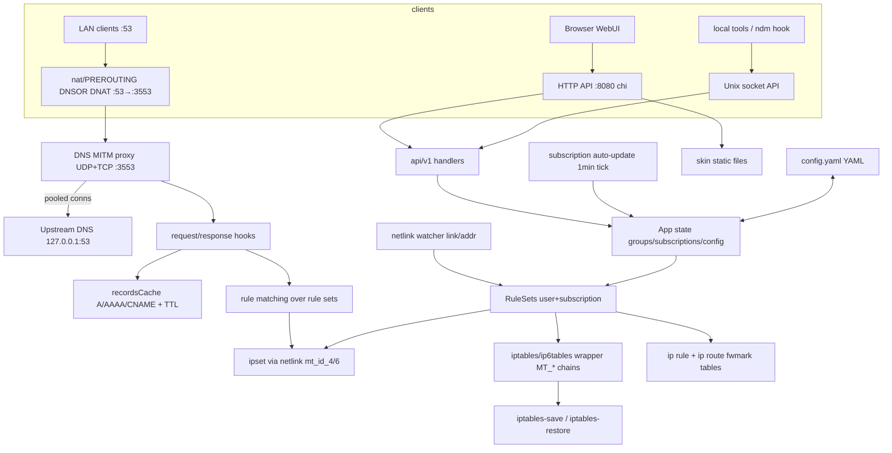
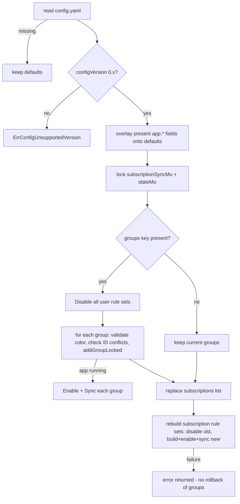
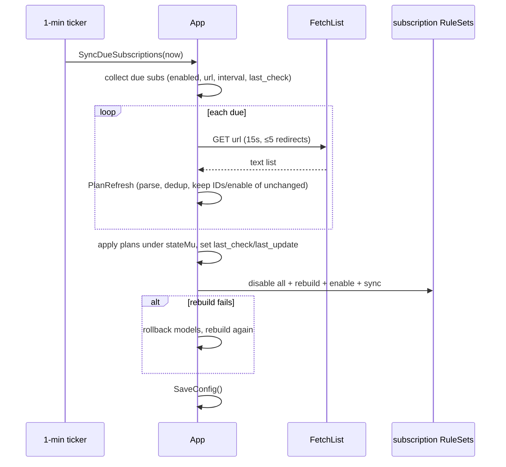
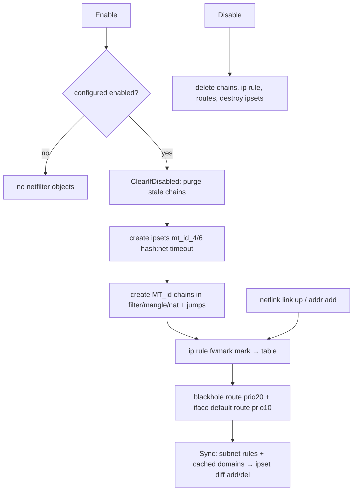

# Current Architecture (Go backend) — Phase 0 audit

Source of truth: branch state at the commit this document was added in.
Module: `magitrickle` (Go 1.23), entry point `src/backend/cmd/magitrickled/main.go`.

## 1. Process entry and lifecycle

### Startup (`cmd/magitrickled/main.go`)

1. zerolog console writer is installed; version banner logged.
2. PID file check (`constant.PIDPath`): if the file contains a PID whose
   `/proc/<pid>/exe` basename equals ours, startup aborts ("already running");
   otherwise a stale PID file is removed.
3. PID file written (mode 0644).
4. `magitrickle.New()` creates the `App` with `constant.DefaultAppConfig`, then
   immediately calls `LoadConfig()`. A missing config file is *not* an error;
   a config-load error is logged and startup continues with defaults so far
   applied.
5. `App.Start(ctx)` runs in a goroutine; `main` loops on signals:
   - `SIGINT`/`SIGTERM` → context cancel (graceful shutdown, once).
   - `SIGHUP` → `App.LoadConfig()` (live reload; errors only logged).
6. When `Start` returns, PID file is removed and the process exits.

### `App.Start` (`start.go`) — startup order

1. `enabled` CAS false→true (second `Start` returns `ErrAlreadyRunning`);
   a deferred `recover()` converts panics into an error return.
2. Logging level applied from `config.LogLevel` (unknown value → info).
3. DNS MITM proxy constructed (upstream addr, `MaxIdleConns`, `MaxConcurrent`,
   `Timeout`); request/response hooks attached.
4. `recordsCache.New()` + background cleanup goroutine every 30 s.
5. `netfilterTools.New` — builds `iptables`/`ip6tables` wrappers unless
   `DisableIPv4`/`DisableIPv6`; registers chain patches for
   `filter/FORWARD`, `mangle/PREROUTING`, `nat/PREROUTING`, `nat/POSTROUTING`.
6. `CleanIPTables()` — removes any stale `MT_*` chains/jumps from a previous
   run (parses `iptables-save` output, batch-commits deletions).
7. netlink subscriptions: `LinkSubscribe`, `AddrSubscribe` (two channels,
   closed via `done` channels on shutdown).
8. HTTP API server (`api.SetupHTTP`) — only if `HTTPWeb.Enabled`.
9. Unix socket API server (`api.SetupUnixSocket`) — always.
10. DNS UDP + TCP listeners started (two goroutines).
11. Addresses of each configured `link` (default `[br0]`) are collected;
    a missing link is a **fatal** startup error.
12. Unless `DisableRemap53`: `PortRemap` ("DNSOR" chain) DNATs
    TCP+UDP :53 → proxy port on those addresses, inserted at
    `nat/PREROUTING` position 1.
13. Every rule set (user groups then subscription groups) gets
    `Enable()` + `Sync()`; any failure is fatal for startup.
14. Subscription auto-update loop goroutine (`StartSubscriptionAutoUpdate`).
15. Main select loop: link events, addr events, server error channel,
    context cancellation.

### Shutdown order (deferred, reverse)

group `Disable()` for every rule set → PortRemap `Disable()` → DNS listeners
(via context) → Unix server close → HTTP server close → netlink `done`
channels → DNS MITM `Close()` (conn pools) → `enabled=false`. The records
cache goroutine and subscription loop stop via context. PID file removed by
`main`.

## 2. State model and concurrency

```
App
├── enabled            atomic.Bool          — core running flag
├── config             models.AppConfig     — written only by LoadConfig (no lock!)
├── stateMu            sync.RWMutex         — guards userRuleSets, subscriptionRuleSets, subscriptions
├── subscriptionSyncMu sync.Mutex           — serializes subscription sync/rebuild flows
├── dnsMITM            *DNSMITMProxy
├── nfHelper           *netfilterTools.Helper
├── recordsCache       *recordsCache.Records (own RWMutex)
├── userRuleSets       []*RuleSet
├── subscriptionRuleSets []*RuleSet
├── dnsOverrider       *PortRemap
└── subscriptions      []*models.Subscription
```

- `RuleSet` has its own `sync.Mutex` + `enabled atomic.Bool`; every public
  method takes the mutex and checks both `enabled` (runtime) and
  `ConfiguredEnabled()` (model flag).
- `recordsCache.Records` has one RWMutex over three maps
  (`addresses`, `aliases`, `reverseAliases`).
- `iptables.IPTables` has an RWMutex over its pending rules tree.
- `models.Rule` lazily compiles regex via `sync.Once` + WaitGroup.
- **Note:** `App.config` is read from many goroutines and replaced field-wise
  by `LoadConfig` (SIGHUP) without a lock — a benign-in-practice data race
  that the C version must not reproduce (use a proper snapshot swap).

### Goroutines (steady state)

main select loop; UDP listener; TCP listener; one goroutine per in-flight
DNS request (bounded by `MaxConcurrent` semaphore, default 100); records
cleanup ticker; subscription auto-update ticker; HTTP serve; Unix serve;
netlink internal goroutines; plus Go runtime threads.

## 3. DNS request path

```
client → (iptables DNAT :53→:3553 unless disabled) → proxy listener
```

**UDP** (`dnsMITMProxy.ListenUDP`): one socket; per-datagram control messages
(`IPV6_RECVPKTINFO`/`IP_PKTINFO`) capture the original destination address +
ifindex so the reply is sent from the address the client queried
(dual-stack via ipv6.PacketConn wrapping, IPv4-only listen via ipv4).
Read deadline of 1 s is used to poll ctx cancellation. Each datagram:
copy into fresh buf (pool-backed read buffer), acquire semaphore slot,
spawn goroutine.

**TCP** (`ListenTCP`): accept with 1 s deadline poll; semaphore; goroutine
per connection. **Exactly one query per TCP connection** — read 2-byte
length + frame (max 65535), process, write length + response, close.

**processReq** (shared): parse request with `miekg/dns` only because hooks
are set; RequestHook may synthesize an immediate response (fake PTR);
otherwise the *raw* request bytes are forwarded upstream via a pooled
connection (`connPool`: channel of idle conns, dial on empty; UDP pool
= connected UDP sockets). TCP upstream framing done manually. Response
parsed, `respMsg.Compress = true` set, ResponseHook may rewrite it
(AAAA filtering), result packed and returned; otherwise raw upstream bytes
are echoed back.

**Timeout:** per-request context with `config.DNSProxy.Timeout`
(default 5000 ms); deadline applied to upstream conn; on error the upstream
conn is dropped instead of returned to the pool.

### Hooks (`dns.go`)

- `dnsRequestHook`: logs every question; if `!DisableFakePTR` and the request
  is a single PTR question → immediate NXDOMAIN reply (RA bit set), never
  forwarded upstream.
- `dnsResponseHook`: schedules `handleMessage` (defer) and, unless
  `DisableDropAAAA`, removes all AAAA answers from the response returned to
  the client (cache still sees them via handleMessage; **ipset still gets
  the AAAA IPs**).

### Response processing (`handleMessage`)

Only `Rcode == Success` messages processed. For each answer RR:

- **A/AAAA**: `trimFQDN` name → `recordsCache.AddAddress(name, ip, ttl+additionalTTL)`;
  collect `GetAliases(name)` (the name + every domain CNAME-pointing at it,
  transitively via reverse index, BFS with cycle guard); for every rule set
  (user + subscription): scan enabled rules in order, first rule matching
  *any* alias wins → `AddIPv4/6Subnet(ip/32 or /128, ttl)` into the group's
  ipset, then next group ("break Rule").
- **CNAME**: `AddAlias(name→target, ttl+additionalTTL)` (single alias per
  name; reverse index updated); then for each group whose rule matches any
  alias of the *name*, re-add all currently cached addresses resolvable
  through the chain with their remaining TTL.

### Records cache (`utils/recordsCache`)

- `addresses: map[domain][]*Address{IP, Deadline}` (dedup by IP, deadline
  refreshed).
- `aliases: map[domain]*Alias{target, Deadline}` — one outgoing CNAME per
  domain, last write wins.
- `reverseAliases: map[target][]domain` — BFS source for `GetAliases`.
- `GetAddresses` walks alias chain forward (cycle-guarded) until addresses.
- Cleanup goroutine every 30 s deletes expired entries. No size/memory cap.
  TTLs already include `AdditionalTTL`.

## 4. Rule matching (`models/rule.go`)

Match input is the *trimmed* (no trailing dot) name from DNS answers,
original case preserved (miekg returns wire case; matching for `domain`/
`namespace` is **case-sensitive**, regex is compiled `IgnoreCase`,
wildcard `IGLOU-EU/go-wildcard` match is case-sensitive).

- `domain`: string equality.
- `namespace`: equality or dot-boundary suffix.
- `wildcard`: `wildcard.Match` (`*`, `?`).
- `regex`: `dlclark/regexp2` with `IgnoreCase`; compiled lazily on first use;
  invalid pattern → never matches (`Compile` returns error).
- `subnet`/`subnet6`: **always false** for DNS names — these types are
  materialized directly into the ipset by `RuleSet.sync()`, not matched
  against domains.

## 5. RuleSet lifecycle (`rule_set.go`)

`RuleSet` wraps `rulesets.Spec` (either user group model or subscription-built
pseudo-group; `RuntimeKey` = hex ID = ipset/chain name suffix).

- `Enable()`: skips netfilter entirely if the group is configured-disabled;
  otherwise creates `IPSet` (two kernel sets `mt_<id>_4` (hash:net, inet)
  and `mt_<id>_6` (inet6), default timeout 300, destroyed/recreated if type
  differs), then `IPSetToLink.Enable()`:
  - iptables (v4 and/or v6): chain `MT_<id>` in `filter` (ACCEPT out via
    iface matched by set), `mangle` (RETURN for ctdir REPLY; MARK
    `--set-mark <mark>`; CONNMARK `--save-mark` — Keenetic requirement),
    `nat` (MASQUERADE for set), each hooked from FORWARD/PREROUTING/
    POSTROUTING; batch-committed via `iptables-restore --noflush`.
  - ip rule: `fwmark <mark> → table <table>` (v4/v6); mark and table are
    allocated by scanning existing rules/routes starting from
    `StartMarkTableIndex` (0x4D616769).
  - ip route: blackhole default (prio 20) in the table + default route via
    the group's interface (prio 10, with gateway discovery); interface may
    be absent/down — handled later by netlink hooks. `blackhole` is a
    reserved interface name (blackhole-only routing).
- `Sync()`: builds the desired ipset contents: `subnet`/`subnet6` rules
  parsed as CIDR-or-single-IP (a 0.0.0.0/0 entry is split into two /1s —
  netlink library limitation); all other rules matched against every cached
  domain, taking cached addresses with remaining TTL; then diffs against
  the kernel set (list via netlink) — adds missing/longer-TTL entries,
  deletes stale ones.
- `Disable()`: unlink iptables chains, delete ip rule/routes, destroy ipsets.

## 6. Netfilter helper details

- `utils/iptables`: an in-memory model of desired chain state
  (`chainPatch` = merge into existing chain; `chainOverride` = fully-owned
  chain (flush + replace); `chainDelete`), compiled into an
  `iptables-restore --noflush` script diffed against `iptables-save` output.
  Real executable = `iptables-save`/`iptables-restore` (v6 variants);
  fake executable used by tests. Commit debounce: pending changes are
  committed explicitly (`Commit()`); the `netfilterd` API hook triggers
  `ForceCommitIPTables` on external firewall reloads (Keenetic
  `/opt/etc/ndm/netfilter.d` script posts to the Unix socket).
- `ipset` is pure netlink (`vishvananda/netlink`): create/destroy/add/del/
  list with per-entry timeout, `Replace: true` on add.
- `PortRemap` ("DNSOR"): DNAT per configured link address.

## 7. Netlink watcher (`netlink.go`)

- Link events: on RTM_NEWLINK with IFF_UP, every rule set routed via that
  interface gets `LinkUpHook` → re-inserts ip rule + routes.
  RTM_DELLINK only logged.
- Addr events: on new address, matching rule sets get `AddrChangeHook` →
  same re-insert. Removed addresses ignored.
- `constant.IgnoredInterfaces` (entware_kn: ezcfg0, ra0..ra15) only
  suppresses debug logging and UI listing, not hook dispatch.

## 8. HTTP API / Unix socket / WebUI

- HTTP (`api/http.go`): chi router; `middleware.Recoverer`; auth middleware
  applies only to `/api/*` paths, skipped when auth disabled or path is
  `/api/v1/auth`; `/api/v1` mounted; everything else served from
  `<AppShareDir>/skins/<skin>/` with manual file reading, directory →
  `index.html` (one level), fixed MIME map (html/css/js/ico/png/svg else
  text/plain), 404 JSON error for missing files, HTML placeholder when `/`
  requested and skin missing. No caching headers, no compression, no
  request limits, no timeouts on the server.
- Unix socket (`api/unixsocket.go`): same `/api/v1` router, **no auth
  middleware ever**; socket file removed before bind and after shutdown;
  default permissions (no chmod).
- Auth (`api/auth`): login+password checked against system
  `/etc/shadow` (fallback `/etc/passwd`; Entware: `/opt/etc/{shadow,passwd}`)
  supporting MD5-crypt `$1$`, SHA-256 `$5$`, SHA-512 `$6$` (with `rounds=`);
  hand-rolled HS256 JWT: secret = per-install random 32 bytes stored
  base64 in `<state>/auth_secret` (0600), signing key =
  hex(HMAC(secret, passwordHash)) — tokens auto-invalidate on password
  change; 20-year expiry; verification re-derives from the *unverified*
  `sub` claim then checks signature, issuer, expiry.
- Routes: see `compatibility-contract.md` §HTTP for the full table.
- v1 handlers mutate app state and fire `SaveConfig()` *after* replying
  (in a goroutine for most handlers — response arrives before persistence).

## 9. Subscriptions

- Model: ID, name, interface, enable, URL, interval (s), last_update
  (persisted), last_check (runtime only), rules (typed like group rules but
  no per-rule name).
- Fetch: http/https only, 15 s timeout, manual redirect following
  (301/302 only, max 5, loop detection), whole body read into memory
  (no size limit).
- Parse: split on `\n`, `\r`, `,`; trim; skip empty/`#` comments; dedup by
  (detected type, line); type auto-detect (subnet → subnet6 → regex-ish
  heuristics → wildcard if `*`/`?` → domain/namespace); random unique 4-byte
  IDs; `RefreshRules` preserves ID/Enable/Type of rules whose text is
  unchanged.
- Auto-update: 1-minute ticker; a subscription is due when enabled, URL and
  interval set, and `now ≥ last_check(+fallback last_update) + interval`;
  on change rebuild all subscription rule sets and `SaveConfig`.
- Rebuild (`syncSubscriptionRuleSetsLocked`): disable all current
  subscription rule sets, rebuild from models (`sub_<id>` runtime key,
  name prefix "Subscription: "), enable+sync each if app running; rollback
  to previous list on failure.

## 10. Configuration

- Load: read YAML into pointer-typed `config.Config`; `configVersion` must
  start with `0.` else `ErrConfigUnsupportedVersion`; every present field
  overlays the corresponding `AppConfig` default (`applyIfSet`);
  legacy numeric timeouts are normalized (dnsProxy.timeout < 1 ms ⇒ value
  interpreted as ms; ipset.additionalTTL < 1 s ⇒ value interpreted as s);
  groups: invalid `color` → `#ffffff`, else lowercased; group/rule ID
  uniqueness enforced (conflict aborts load, may leave groups partially
  replaced); subscriptions replaced wholesale; subscription rule sets rebuilt.
- Save: marshals **live** models under read lock; every app field written
  explicitly (full tree, no omissions); groups from live rule sets;
  `configVersion` = build version; directory created `0777&umask`,
  file written 0600 non-atomically (no temp+rename, no fsync).
- Durations marshal as Go duration strings (`5s`, `1h0m0s`); yaml v2 parses
  both strings and bare integers (bare integer = **nanoseconds**, hence the
  legacy normalization above).

## 11. Platform differences

| Aspect | default (no tag) | `entware` | `entware`+`entware_kn` | `openwrt` |
|---|---|---|---|---|
| config/state dir | /var/lib/magitrickle | /opt/var/lib/magitrickle | same | /etc/magitrickle/state |
| share dir (skins) | /usr/share/magitrickle | /opt/usr/share/magitrickle | same | /usr/share/magitrickle |
| PID / socket | /var/run/magitrickle.{pid,sock} | /opt/var/run/… | same | /var/run/… |
| passwd/shadow | /etc/{passwd,shadow} | /opt/etc/{passwd,shadow} | same | /etc/{passwd,shadow} |
| ignored ifaces | none | none | ezcfg0, ra0–ra15 | none |
| iface aliases in UI | none | none | Keenetic RCI API (localhost:79) | none |
| extra integration | — | — | ndm netfilter.d hook script (socat POST on firewall reload) | procd respawn, uci enable flag |

Interface listing hides point-to-point-less interfaces by default
(`ShowAllInterfaces=false` shows only PPP-flagged links minus ignored).
Note: the filter keeps interfaces **with** FlagPointToPoint only.

## 12. Packaging and installation

- `make package_ipk`: hand-rolled ipk (control.tar.gz + data.tar.gz +
  debian-binary). Entware deps: `libc, iptables` (+`socat` for `_kn`);
  OpenWrt deps: `libc, iptables-nft, iptables-mod-conntrack-extra,
  kmod-ipt-nat, kmod-ipt-ipset, ip6tables-nft`.
- `make package_apk` (OpenWrt only): `apk mkpkg` with ECDSA signing,
  post-install/pre-deinstall/post-upgrade scripts, conffiles.
- conffiles protect the YAML config across upgrades; Entware postinst
  restarts the service; OpenWrt uses default procd enable/start.
- Backend binary UPX-compressed (`upx -9 --lzma`) except riscv64/mips64/
  mips64le/loong64.
- Frontend `dist/` installed to `<share>/skins/default`.

## 13. Diagrams

### Component diagram



### DNS request processing

```mermaid
sequenceDiagram
    participant C as Client
    participant P as DNS proxy
    participant U as Upstream
    participant RC as recordsCache
    participant IS as ipset

    C->>P: query (UDP dgram / TCP conn)
    P->>P: semaphore acquire (MaxConcurrent)
    P->>P: parse; RequestHook
    alt single PTR question && !DisableFakePTR
        P-->>C: NXDOMAIN (fake PTR)
    else
        P->>U: raw request (pooled conn, deadline)
        U-->>P: response bytes
        P->>P: parse; ResponseHook
        Note over P: defer handleMessage
        alt !DisableDropAAAA
            P->>P: strip AAAA answers
        end
        P-->>C: response
        P->>RC: AddAddress/AddAlias (TTL+additionalTTL)
        P->>RC: GetAliases(name)
        loop each rule set
            P->>P: first enabled rule matching any alias
            P->>IS: AddIPv4/6Subnet(ip, ttl) [if group enabled]
        end
    end
```

### Config reload (SIGHUP / initial load)



### Subscription update



### Netfilter lifecycle (per rule set)


